# Hangman

Hangman is a Python terminal game, which runs in the Code Institute mock terminal Heroku. 

Users can try to beat the computer by guessing the letters of the missing word. Every wrong guess takes one life. The game is over if the user guesses all the missing letters of the hidden word or if he loses all his lives.

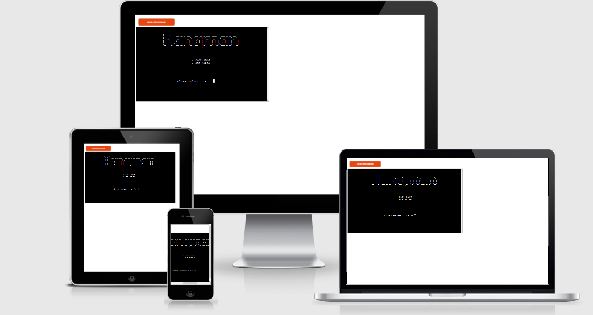

You can view the live site [here](https://hangman-fun-game.herokuapp.com/)

# How to play

It's a popular word guessing game where the player attempts to build a missing word by guessing one letter at a time. 

The player can choose the difficulty level. Easy (10 lives), medium (8 lives) and hard (6 lives). Each level increases the number of letters a player must guess

The player must guess the letters of the hidden word, if the guess is correct, the letter missing in the word is replaced by the correct letter.

If the player puts an incorrect letter, the error message is displayes and the player is asked to resubmit their choce. Each wrong guess takes 1 life. 

Game ends if the player correctly guesses all the letters of the missing word or if the player loses all his lives.

# User Stories 

- As a user I want to easily understand the purpose of the game
- As a user I want to have fun
- As a user I want to see my remaining lives
- As a user I want the game to be challenging 

# Design

## Flowchart:

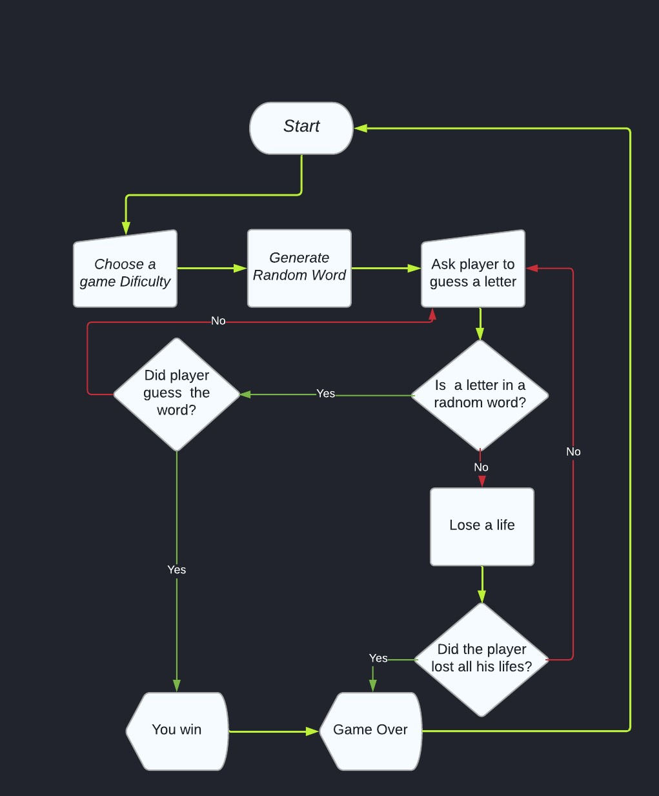

## Wireframes

## Home Page

## Rules

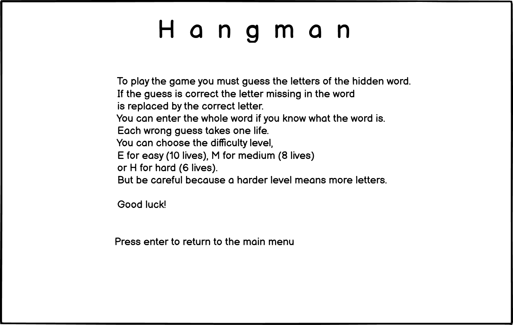

## Select difficulty level

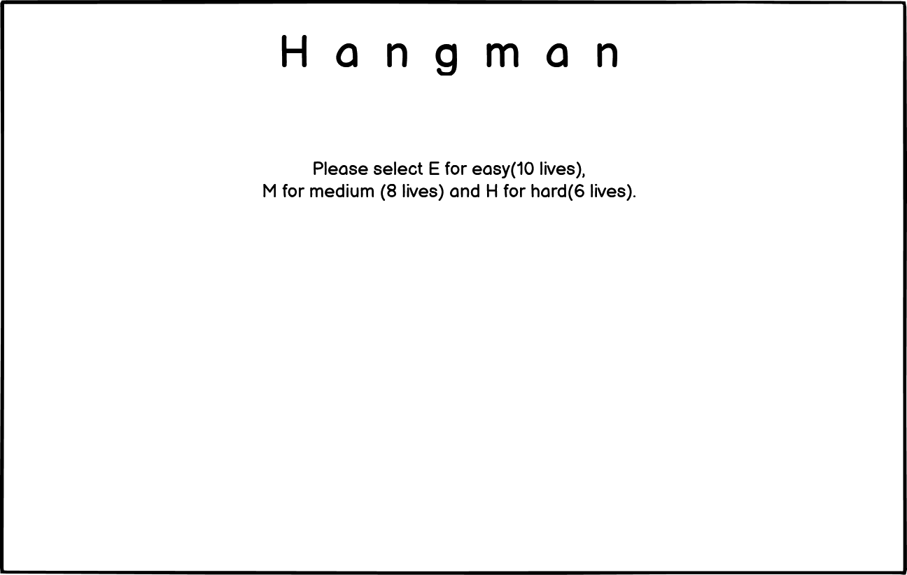

## Game

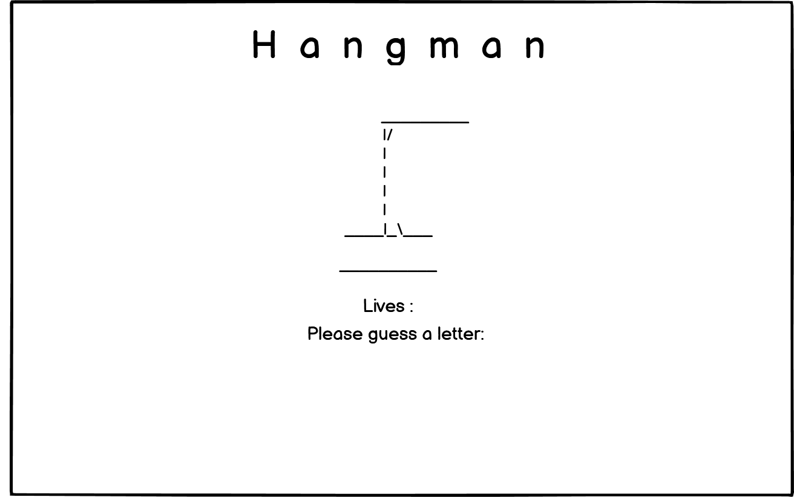

# Features

- Welcome Screen - User can choose between starting the game or see the rules

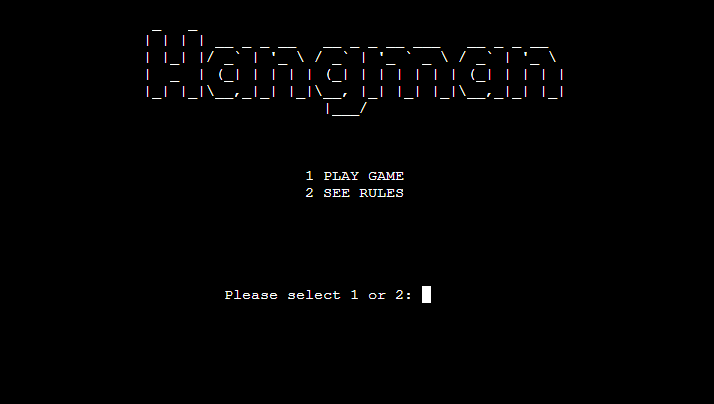

- Game rules - the user can see the game rules by selecting number two from the main menu

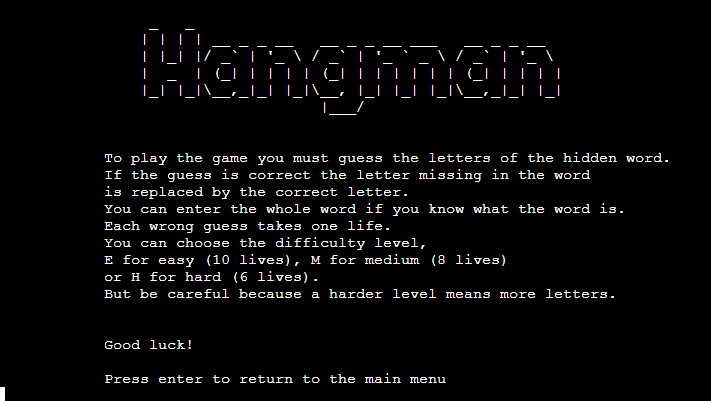

- Difficulty Level - by selecting number one from the main menu user can also select the difficulty level and start the game. Each level increases the number of letters a player must guess

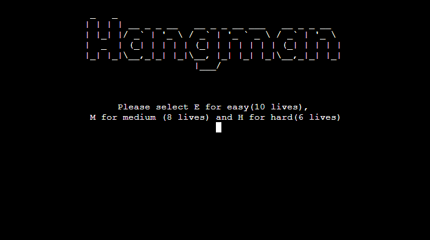

- Game - the game will start by selecting the game difficulty. Random word will be selected from a list of selected words

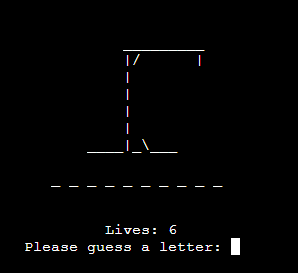

- User Input - the player is asked to guess a letter. If the entry is correct, the letter will appear in the word, if the entry is incorrect, the user will lose one life and the hangman will start drawing.

- Invalid inputs - to be sure that the user provided  the correct input. For any invalid input, the error message  will appear. 

* Please select 1 or 2
* Select E, M or H
* Not a valid guess
* You must press Y or N

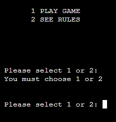
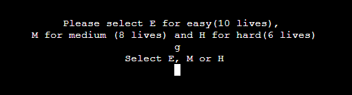
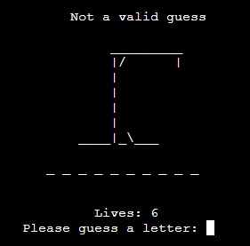
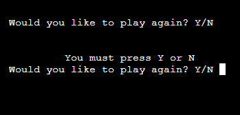

# Issues and Bugs
 - Error message line too long
    - I fixed the error by splitting the string into two lines

- I used print ('{:^80}'.format which caused the error: 
"Formatting a regular string which could be a f-string"
    - I fixed the error by using the .center(width) method 
- Error - rules page. Creating a menu variable with input("Press enter to return to the main menu) caused the error : "local variable 'menu' is assigned to but never used"
    - I fixed the error by removing the menu variable
- The title does not appear on the new page
    - I fixed the error by calling the clear_termina function before the title function

# Technologies Used
- Languages 
    - Python

# Testing
## Validators
The [PEP8 Validator](http://pep8online.com/checkresult) and [Python Code Checker](https://extendsclass.com/python-tester.html) were used to check my code for syntax errors in this project.

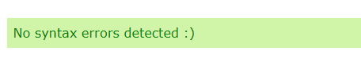

- Manually tested user inputs by purposefully inputing incorrect data to confirm error messages where capturing wrong inputs

- Tested in the local terminal and on the mock terminal on the deployment site on Heroku 

# Deployment 
### The project was deployed using Code Institute mock terminal for Heroku.

### Steps to deploy:
- Fork or clone this repository
- Ensure the Procfile is in place
- Create a new app in [Heroku](https://id.heroku.com/login)
- Select "New" and "Create new app"
- Name the new app and click "Create new app"
- In "Settings" select "BuildPacks" and select Python and Node.js
- While still in "Settings", click "Reveal Config Vars" and input the following. KEY: PORT, VALUE: 8000. Nothing else is needed here as this project does not have any sensitive files.
- Click on "Deploy" and select your deploy method and repository.
- Click "Connect" on selected repository.
- Either choose "Enable Automatic Deploys" or "Deploy Branch" in the manual deploy section.
- Heroku will now deploy the site.

# Credits

- [Code Institute](https://codeinstitute.net/) for the mock terminal for the deploy to a live site.
- [Hangman-youtube-tutorial Kite](https://www.youtube.com/watch?v=m4nEnsavl6w) inspiration on how to build a hangman game. 
- [ASCII Art Generator](https://patorjk.com/software/taag/#p=display&f=Standard&t=Hangman) for creating word art for game title.
 

